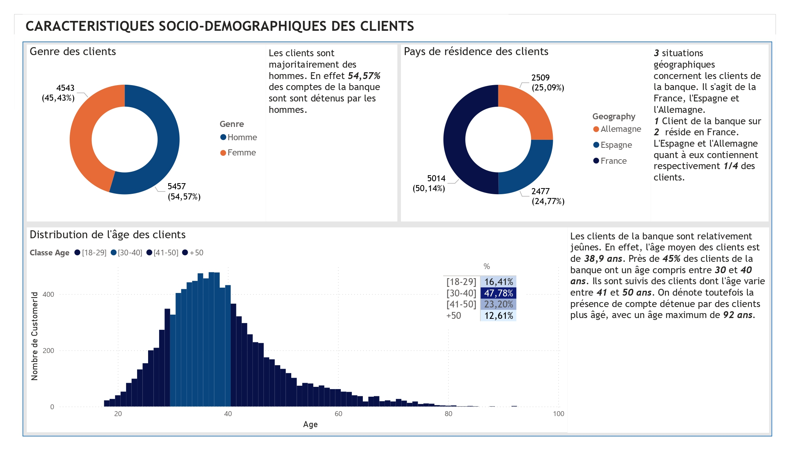
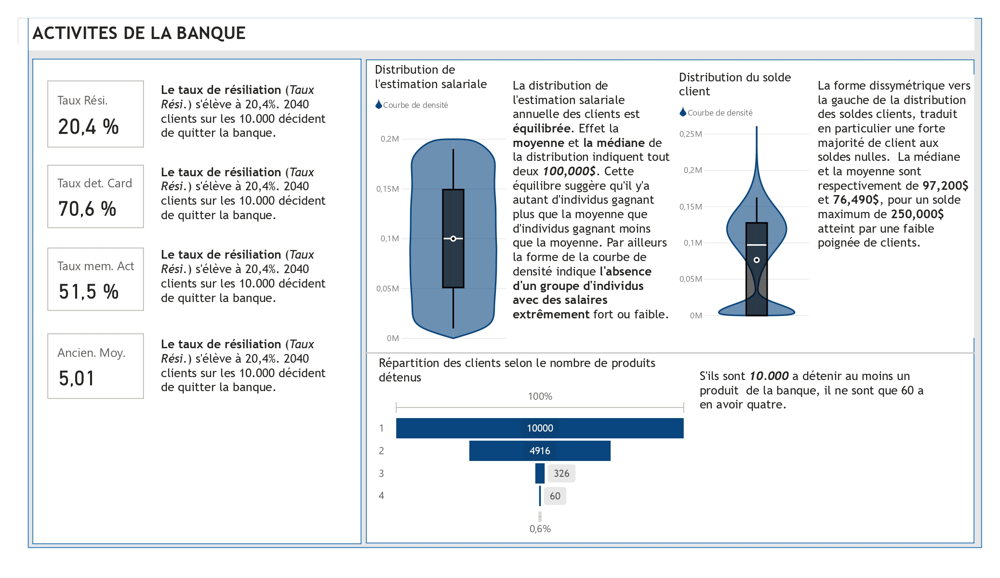
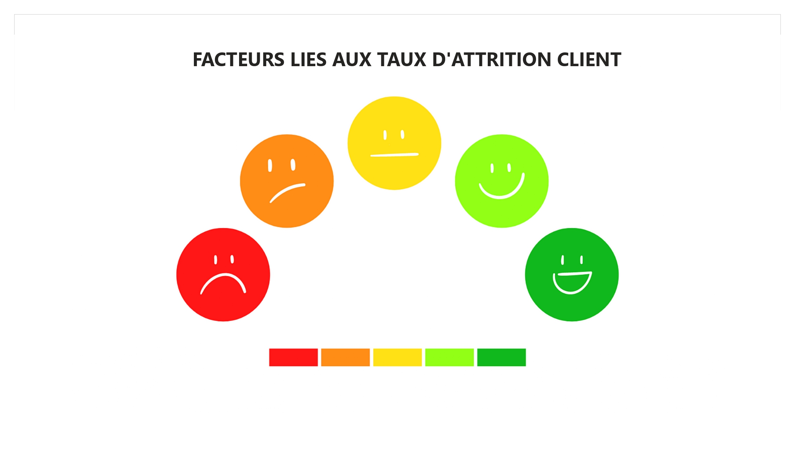
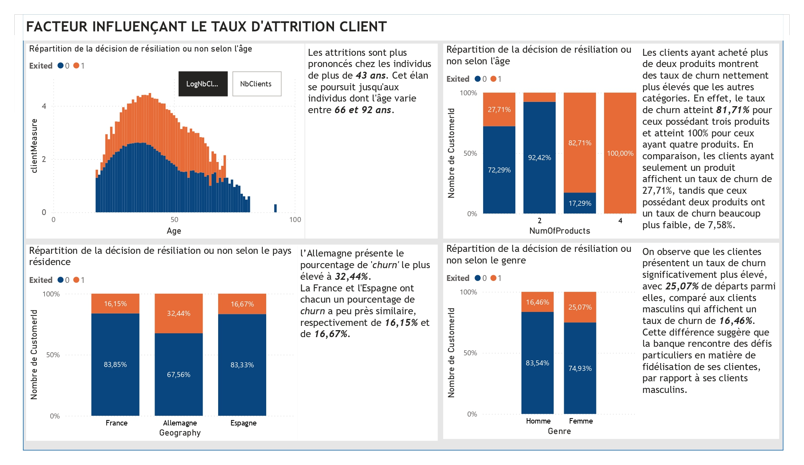
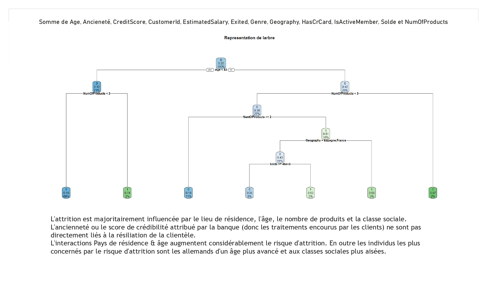

# 🎯 Projet de Visualisation de Données - Power BI

Bienvenue dans ce projet de visualisation de données réalisé à l’aide de **Power BI**.  
Ce tableau de bord interactif a été conçu pour fournir une analyse claire et approfondie à partir d’un jeu de données spécifique.

## 📝 Objectifs du projet

- Présenter des **indicateurs clés** de performance (KPI)
- Faciliter la **prise de décision** grâce à des visualisations compréhensibles
- Explorer les **tendances**, **corrélations** et **anomalies** dans les données

---

## 📊 Aperçu du Dashboard Power BI

Voici un aperçu des différentes pages du rapport :

### Slide 1 – HomePage 1

---

### Slide 2 – Caractéristiques socio-Démographiques des clients

---

### Slide 3 – Activité de la banque

---

### Slide 4 – HomePage 2

---

### Slide 5 – Facteurs liés au churn

---

### Slide 6 – Synthèse finale

---

## ⚙️ Technologies utilisées

- [Power BI](https://powerbi.microsoft.com/)
- Microsoft Excel (préparation des données)
- GitHub (partage et documentation du projet)

## 🙌 Remerciements

Merci à Amadou BAH (Amed2000@gmail.com) pour sa contribution à ce projet .

---

## 📬 Contact

Pour toute question ou suggestion, n’hésitez pas à me contacter via [LinkedIn](https://www.linkedin.com/in/frederic-1034a4183/) ou à ouvrir une issue sur ce dépôt.
